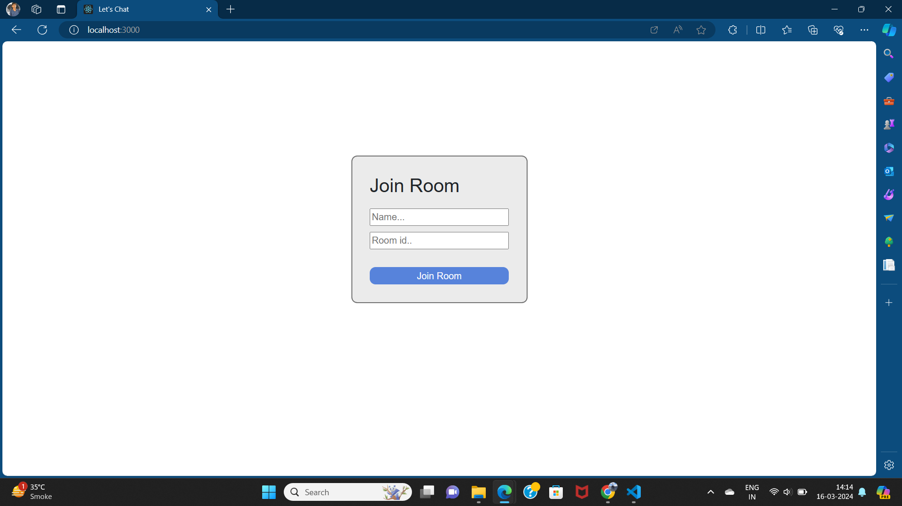
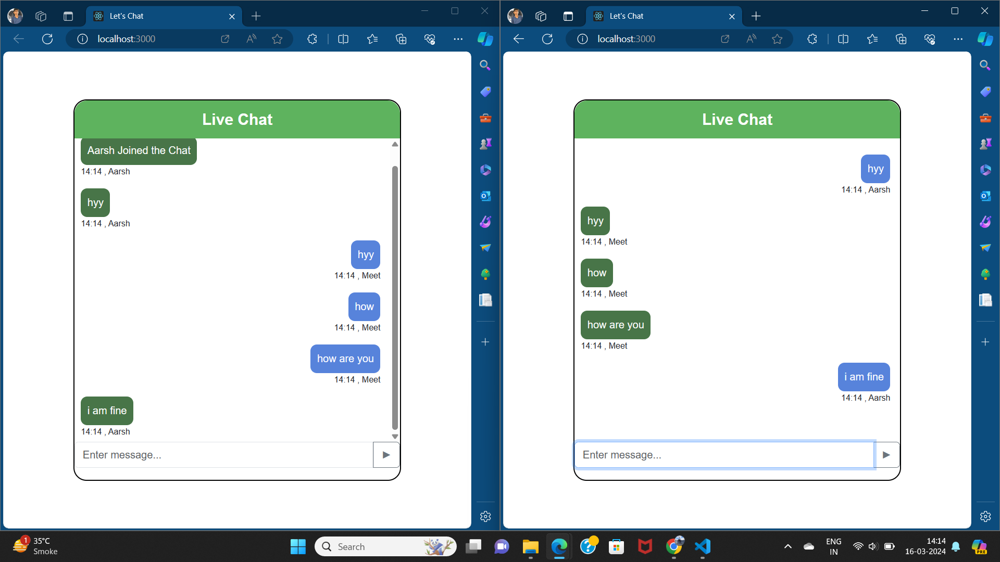
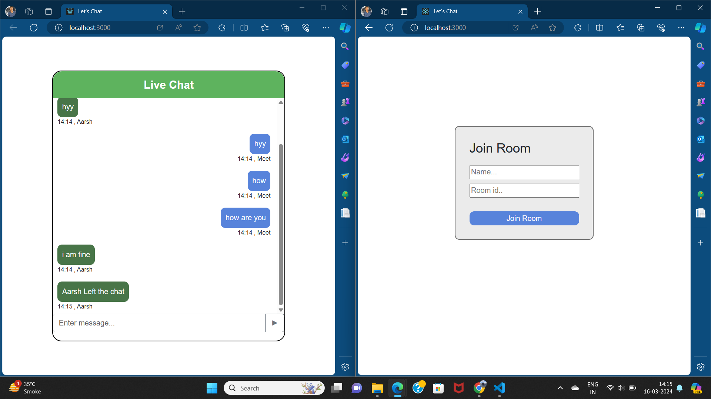

# Let's Chat  

Let's Chat is a real-time chat application.

it's a basic chat application in which user join the room and do chat with the persons in the same room


## Tech Stack

**Client:** React , Css , socket.io

**Server:** Node js,  Express js

## Environment Variables

To run this project, you will need to add the following environment variables to your .env file

**Client:** 

`REACT_APP_SOCKET` :- Node server URL

**Server:** 

`PORT`:- Port number where your server running

`ORIGIN`= Client URL

## Screenshots






## Run Locally

Clone the project

```bash
  git clone https://github.com/AarshPrajapati/Let-s-Chat
```

Go to the project directory

```bash
  cd client
```

Install dependencies

```bash
  npm install
```
Add Environment Variable

```bash
  `REACT_APP_SOCKET` :- Node server URL

  `PORT`:- Port number where your server running

  `ORIGIN`= Client URL
```

Start the application

```bash
  npm run both
```


## 🔗 Links
[](/)

[](https://www.linkedin.com/in/aarsh-prajapati-167825270//)

[](https://www.instagram.com/aarsh._.802/)

## Author

- [@AarshPrajapati](https://github.com/AarshPrajapati)


## 🛠 Skills
Javascript, JQuery, HTML, CSS, Bootstrap, React js, Node js, Express js, Asp.net MVC, php, python, Unix, Mongodb, MSSQL, XAMPP, Orecal


